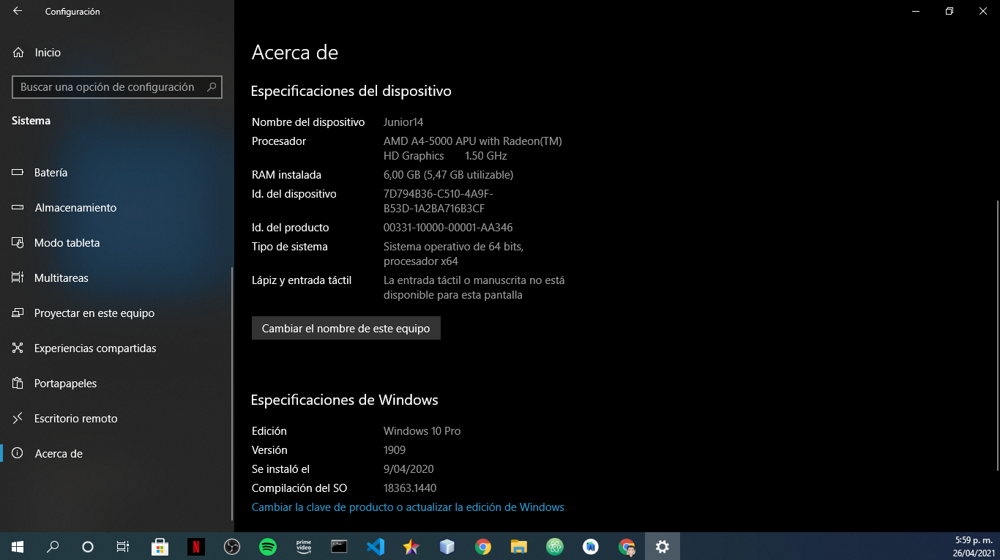
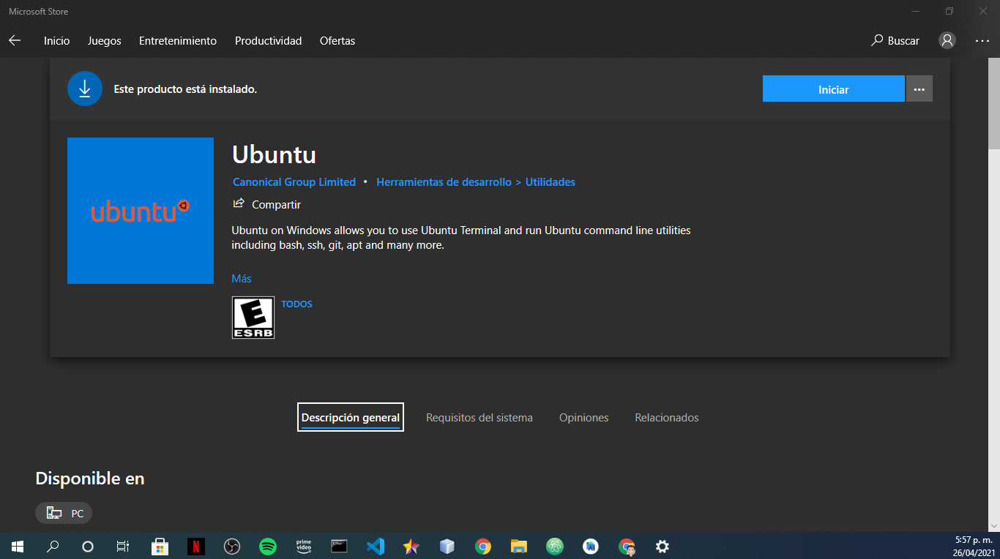

# Instalacion de ruby on rails en windows10

### Requisitos
  - sistema operativo windows 10 con versión de compilación  16237.0 o posterion.
  - arquitectura de 64 bits.



  ### Descripción general

  Configuraremos un entorno de desarrollo de Ruby on Rails en Windows 10.

  La razón por la que usaremos Bash en Ubuntu en Windows es porque le permite ejecutar Linux en su máquina con Windows. La mayoría de los tutoriales y dependencias de Ruby on Rails funcionan mejor en Linux, por lo que esto le permite obtener lo mejor de ambos mundos. Una máquina Windows para su trabajo diario y un subsistema Linux para el desarrollo de Ruby on Rails.

  Esto solo funciona en instalaciones de Windows de 64 bits. Esto también está en versión beta, por lo que no será tan sólido como ejecutar una máquina virtual Linux, pero definitivamente puede hacer lo básico lo suficientemente bien.

### Instalación del subsistema de Windows para Linux <br><br>
Windows 10 le permite ejecutar varios sistemas operativos Linux dentro de Windows de manera similar a una máquina virtual, pero implementado de forma nativa. Usaremos esto para instalar Ruby y ejecutar nuestras aplicaciones Rails.

Abra Powershell como administrador y ejecute:


```
subsistema de linux

dism.exe /online /enable-feature /featurename:Microsoft-Windows-Subsystem-Linux /all /norestart
```
```
maquina virtual

dism.exe /online /enable-feature /featurename:VirtualMachinePlatform /all /norestart
```

A continuación, [instale Ubuntu desde Microsoft Store](https://www.microsoft.com/en-us/p/ubunt[[u/9nblggh4msv6).



Recomendación: reiniciar el equipo antes de abrir ubuntu para que pueda tomar el subsistema de linux.

- Ahora abra Ubuntu en el menú Inicio o ejecutándolo ´wsl´ en PowerShell o en el símbolo del sistema. Se le pedirá que configure un nuevo usuario para Ubuntu. Recuerde esta contraseña, ya que es la que utilizará más adelante cuando instale paquetes con ´sudo´.


¡Felicitaciones! Ahora tiene una terminal de Ubuntu en Windows. Utilizará esto para ejecutar su servidor Rails y otros procesos de desarrollo.

## Instalacionde de git
```
sudo apt-get install git
```

## Instalación de Ruby (Versión 2.7.3)
Ejecutar comandos en la terminal de Ubuntu

El primer paso es instalar algunas dependencias para Ruby

```
sudo apt-get update
```

```
sudo apt-get install git-core curl zlib1g-dev build-essential libssl-dev libreadline-dev libyaml-dev libsqlite3-dev sqlite3 libxml2-dev libxslt1-dev libcurl4-openssl-dev software-properties-common libffi-dev
```
### Instalación del rbenv (manejador de versiones de ruby)

La instalación con rbenves un proceso simple de dos pasos. Primero instalas rbenvy luego ruby-build:

```
git clone https://github.com/rbenv/rbenv.git ~/.rbenv
```
```
echo 'export PATH="$HOME/.rbenv/
```
```
bin:$PATH"' >> ~/.bashrc
```
```
echo 'eval "$(rbenv init -)"' >> ~/.bashrc
```
```
exec $SHELL
```
```
git clone https://github.com/rbenv/ruby-build.git ~/.rbenv/plugins/ruby-build
```
```
echo 'export PATH="$HOME/.rbenv/plugins/ruby-build/bin:$PATH"' >> ~/.bashrc
```
```
exec $SHELL
```
```
rbenv install 2.7.3
```
```
rbenv global 2.7.3
```
```
ruby -v
```

El último paso es instalar Bundler

```
gem install bundler
```
```
rbenv rehash
```

## Configurando Git

```
git config --global color.ui true

git config --global user.name "YOUR NAME"

git config --global user.email "YOUR@EMAIL.com"
```

## Instalación de Rails (Versión 6.1.3.1)

Dado que Rails se envía con tantas dependencias en estos días, necesitaremos instalar un tiempo de ejecución de Javascript como NodeJS y un administrador de paquetes llamado Yarn.

Para instalar NodeJS y Yarn, lo agregaremos usando el repositorio oficial:

```
curl -sL https://deb.nodesource.com/setup_12.x | sudo -E bash -

curl -sS https://dl.yarnpkg.com/debian/pubkey.gpg | sudo apt-key add -

echo "deb https://dl.yarnpkg.com/debian/ stable main" | sudo tee /etc/apt/sources.list.d/yarn.list

sudo apt update

sudo apt-get install -y nodejs yarn
```

```
gem install rails -v 6.1.3.1

rbenv rehash
```
 Ahora que ha instalado Rails, puede ejecutar el rails -vcomando para asegurarse de tener todo instalado correctamente:

```
rails -v
# Rails 6.1.3.1
```

Si obtiene un resultado diferente por algún motivo, significa que es posible que su entorno no esté configurado correctamente.

